<div align="center">

# KavachX

**Graph-grounded autonomous cyber-reasoning with proof-carrying repair.**

</div>

<p align="center">
  
  
  
</p>

<p align="center">
  
  
  
  
  
</p>

<p align="center">
  
  
  
  
  
</p>

<p align="center">
  <a href="#the-one-command-path">Quick start</a> ·
  <a href="docs/ARCHITECTURE.md">Architecture</a> ·
  <a href="docs/SECURITY.md">Security</a> ·
  <a href="docs/HONESTY.md">Honesty</a> ·
  <a href="docs/DEMO.md">Demo</a>
</p>

> KavachX does not simply find a crash and generate a patch. It first reconstructs an
> executable behavioural specification called **SAMHITA**, uses that specification to
> discover violations, validates findings deterministically, repairs the root cause,
> attacks its own patch through a **Refutation Gauntlet**, and produces a **PRAMAAN**
> evidence-backed assurance certificate.

```
Index → Understand → Discover → Test → Validate → Shield → Repair
      → Attack Repair → Verify → Attest → Publish
```

> It reconstructs the codebase as a **code knowledge graph** (GitNexus + tree-sitter, merged with
> per-edge provenance), layers a **security graph** of sources, sinks, sanitizers and data flows over
> it, reasons over the **attack surface**, generates **targeted security tests**, executes them in an
> isolated sandbox, deterministically validates findings, repairs root causes, attacks its own
> repairs, and produces evidence-backed assurance.

---

## Architecture

Read it left to right. The colour carries the argument:

| | Meaning |
| --- | --- |
| **Teal** | Deterministic. Same input, same output, no model involved. |
| **Purple** | The **only** place a model is consulted — and it can only *propose*. |
| **Amber** | A gate. Every model output crosses one before it can affect the run. |
| **Red** | The isolation boundary. Untrusted code executes only here. |
| **Green** | Proof-carrying output, and the one component that holds a credential. |

```mermaid
%%{init: {"theme":"base","themeVariables":{"clusterBkg":"#151719","clusterBorder":"#3a494b","titleColor":"#00dbe7","nodeTextColor":"#e3e2e2","textColor":"#e3e2e2","lineColor":"#8fa1a3","edgeLabelBackground":"#dfe4e5","tertiaryTextColor":"#e3e2e2","labelTextColor":"#e3e2e2","fontSize":"15px"}}}%%
flowchart LR
  classDef det fill:#0d2b2f,stroke:#00c8d4,stroke-width:1.5px,color:#e6f6f7
  classDef llm fill:#241a38,stroke:#a78bfa,stroke-width:2px,color:#ece7fb
  classDef gate fill:#3a2c08,stroke:#f5b642,stroke-width:2.5px,color:#fdf3dd
  classDef sbx fill:#37150f,stroke:#ff6b5e,stroke-width:2.5px,color:#ffe8e5
  classDef out fill:#0f2a19,stroke:#3ddc84,stroke-width:1.5px,color:#e4f8ec
  classDef store fill:#1b1b20,stroke:#6b7280,color:#d6d6da

  subgraph L1["1 · CODE INTELLIGENCE — fully deterministic, no model"]
    direction TB
    REPO["<b>Target repository</b><br/>pinned to an immutable content SHA-256<br/><i>untrusted DATA, never instructions</i>"]:::det
    GN["<b>GitNexus</b> provider (optional)<br/>resolved symbol references<br/><i>precise, incomplete</i>"]:::det
    TS["<b>tree-sitter</b> provider (always on)<br/>name-matched references, 3 grammars<br/><i>complete, imprecise</i>"]:::det
    MERGE["<b>Provider merge</b><br/>per-EDGE provenance + precision<br/>resolved vs union"]:::det
    KG["<b>Code knowledge graph</b><br/>reproducible identity =<br/>sha256(source + parser versions + options)"]:::det
    HEALTH{{"<b>Index validation</b><br/>10 deterministic checks<br/>grade A/B/C/F<br/><b>+ CLAIM BOUNDS</b><br/>what this index cannot support"}}:::gate
    REPO --> GN
    REPO --> TS
    GN --> MERGE
    TS --> MERGE
    MERGE --> KG --> HEALTH
  end

  subgraph L2["2 · SECURITY MODEL — deterministic, taxonomy-driven"]
    direction TB
    TAX["<b>60 taxonomy rules</b>, extensible<br/>19 sources · 23 sinks · 9 sanitizers<br/>5 validators · 4 auth controls"]:::det
    TAINT["<b>Taint analysis</b> over the AST<br/>proves derivation inside a function"]:::det
    FLOW["<b>Security flows</b><br/>every flow states its <b>basis</b><br/>taint / call-graph / proximity<br/>+ precision + reachability"]:::det
    BOUND["<b>Trust boundaries</b><br/>11 kinds, derived from<br/>(source kind, sink kind)"]:::det
    SURF["<b>Attack surface</b><br/>priority = <b>product</b> of 6 recorded factors<br/>severity · controllability · reachability<br/>· dataflow · controls · coverage"]:::det
    TAX --> TAINT --> FLOW --> BOUND --> SURF
  end

  subgraph L3["3 · REASONING — the ONLY place a model is consulted"]
    direction TB
    CTX["<b>Context builder</b><br/>24 read-only graph tools<br/>hard character budget<br/>trust-labelled envelope:<br/>UNTRUSTED_repository_code<br/>every drop reported, every query logged"]:::det
    LLM["<b>Local LLM — proposes only</b><br/>Qwen3-Coder-30B-A3B (<b>3B active</b>)<br/>+ Qwen3-4B router<br/>llama.cpp / Ollama / vLLM<br/>12 routed tasks<br/><i>air-gapped: no token leaves</i>"]:::llm
    SCHEMA{{"<b>Strict schema gate</b><br/>Pydantic TestSpec / PatchProposal<br/><b>NO field can assert a verdict</b><br/>reject &rarr; the deterministic<br/>fallback still runs"}}:::gate
    CTX --> LLM --> SCHEMA
  end

  subgraph L4["4 · PROOF BY EXECUTION — the sandbox decides"]
    direction TB
    HARN["<b>Harness generator</b><br/>KavachX templates only<br/>model strings become<br/><b>DATA LITERALS</b>, never code"]:::det
    SBX["<b>SANDBOX</b> — hostile code runs here<br/>no credentials · no network · non-root<br/>dropped caps · read-only root · capped<br/>dev | gVisor | Firecracker"]:::sbx
    FUZZ["<b>Coverage-guided fuzzing</b><br/>13 engines, 6 with coverage feedback<br/>code-aware branch seeding<br/>useful = <b>measured</b> coverage delta"]:::det
    ORACLE{{"<b>13 deterministic oracles</b><br/><b>UNSUPPORTED is not HELD</b><br/>N independent reproductions<br/>required before VALIDATED"}}:::gate
    HARN --> SBX --> FUZZ --> ORACLE
  end

  subgraph L5["5 · REPAIR AND ADVERSARIAL VERIFICATION"]
    direction TB
    SHIELD["<b>Shield</b> — reversible mitigation<br/>verified blocking AND benign-safe<br/>starts TIME TO PROTECTION"]:::det
    REG["<b>Regression test</b> from the ACTUAL<br/>reproducing input, proven to fire<br/>on the <b>unpatched</b> build first"]:::det
    ROOT["Root cause located and verified<br/>on the executed path<br/>blast radius computed"]:::det
    PATCH["Patch synthesised · AST policy gate<br/>applied to a <b>COPY</b> in the sandbox"]:::det
    GAUNT{{"<b>REFUTATION GAUNTLET</b><br/>it attacks its own patch<br/>exploit mutation · sibling hunt<br/>differential replay · SAMHITA re-check<br/><i>refuted &rarr; bypass becomes a constraint</i>"}}:::gate
    SHIELD --> ROOT --> PATCH --> GAUNT
    REG --> GAUNT
  end

  subgraph L6["6 · PROOF-CARRYING OUTPUT"]
    direction TB
    PRAMAAN["<b>PRAMAAN evidence graph</b><br/>13 node types<br/><b>dangling-claim REFUSAL</b><br/>assurance A/B/C/R by rule<br/>HMAC-signed<br/>answers 9 'how do you know' questions"]:::out
    PUB["<b>Publisher</b><br/>the <b>ONLY</b> credential holder<br/>never executes repository code<br/>re-runs the policy gate<br/>new branch only, never force<br/>human approval gate"]:::out
    STORE["PostgreSQL 16 or SQLite<br/>29 tables · checkpoint after every node<br/>append-only hash-chained audit log"]:::store
    PRAMAAN --> PUB
    PRAMAAN -.-> STORE
  end

  L1 -- "graded graph<br/>+ stated bounds" --> L2
  L2 -- "ranked candidates" --> L3
  L3 -- "validated TestSpec<br/>+ patch proposals" --> L4
  L2 -- "deterministic fallback:<br/>the whole pipeline runs<br/>with NO model at all" --> L4
  L4 -- "reproduced &rArr; VALIDATED<br/>not reproduced &rArr;<br/>stays a hypothesis" --> L5
  L5 -- "survives all 4 stages &rArr; VERIFIED<br/>refuted &rArr; retry under<br/>a hard constraint" --> L6
```



<p align="center">
  <a href="docs/diagrams/architecture.png">PNG</a> ·
  <a href="docs/diagrams/architecture.svg">SVG</a> ·
  <a href="docs/diagrams/architecture.drawio">draw.io (editable)</a> ·
  <a href="docs/diagrams/architecture.mmd">Mermaid source</a> ·
  <a href="docs/diagrams/architecture-slide.png">compact version for slides</a>
</p>

The shape of the diagram *is* the thesis. A purple box never connects directly to an
outcome — it always passes through an amber gate first, and every gate is a deterministic
component that can reject what the model proposed. Note the edge that bypasses layer 3
entirely: with no model reachable at all, the pipeline still indexes, still derives flows,
still generates oracle-judged tests, and still validates. The model makes it *better*, not
*possible*.

---

## The one command path

### Fastest: the self-contained end-to-end proof

```bash
make demo
```

This drives the full loop — detect → adversarial validation → patch → gauntlet re-attack →
signed certificate — against the seeded vulnerable target, in-process on SQLite with the
deterministic proposer. It needs no PostgreSQL, no Docker and no API keys, and prints the
KAVACH SECURITY PROOF with real reproduction counts, gauntlet stage tallies and certificate
hashes.

### The full walkthrough: clone → fuzz → repair → pull request → certificate

```bash
make dev                                              # API on :8000, console on :3000
python examples/platform-walkthrough/walkthrough.py   # or: make walkthrough
```

[`examples/platform-walkthrough`](examples/platform-walkthrough) drives the product end to end
over the live API and narrates every stage from real state: it **git clones** a repository,
attaches it with recorded authority, follows the run phase by phase, then shows the index bounds,
the surviving contract, the fuzzing campaign, the validated finding, the shield, the refuted patch
and the one that held, the four gauntlet stages, the signed certificate — and finally the
Publisher's payload, committed to a real branch and pushed to that clone's origin. Add `--pause`
for presenter mode. It exits non-zero if any stage did not produce what it claims.

### The interactive console

```bash
make bootstrap   # env + deps + PostgreSQL + migrations + demo seed (needs Docker Desktop)
make dev         # FastAPI on :8000, Next.js on :3000
```

Or run the two processes directly, without make:

```powershell
# terminal 1 — API
cd backend; uv run uvicorn app.main:app --host 127.0.0.1 --port 8000 --reload
# terminal 2 — console
cd frontend; npm run dev
```

Then open <http://localhost:3000>, click **Launch Console**, and log in with the seeded
credentials (default `demo@kavachx.io` / `kavachx-demo-2024`).

To analyse a repository that actually exists on GitHub, go to **New Security Run** and choose:

* **Attach a repository you can push to** — push access is confirmed against the GitHub API before
  the repository is attached, the source is **cloned** at ingest, and a gauntlet-verified repair can
  be approved into a real `kavachx/` branch and pull request. Needs `GITHUB_TOKEN`.
* **Add a public repo** — source is fetched at a resolved commit SHA and analysed in full, but
  publishing is refused by design: KavachX holds no credential for a repository it does not control.
  See [docs/PR_BOT.md](docs/PR_BOT.md) for what would have to be decided to change that.

### Full Docker path (Linux / macOS / Windows with Docker Desktop)

```bash
cp .env.example .env
docker compose up --build
```

### Make (Linux / macOS / WSL)

```bash
make bootstrap    # deps + db + migrate + seed
make dev          # run backend + frontend
make demo         # bootstrap, then drive a full run headlessly and print the certificate
make walkthrough  # narrated end-to-end walkthrough over the live API (needs `make dev`)
make test         # backend test suite
```

---

## What the demo proves

`examples/vulnerable-demo` is a deliberately seeded, fully local vulnerable Python
service. Running it through KavachX produces a **real** end-to-end trace:

| Step | What actually happens |
| --- | --- |
| Ingest | Repository is pinned to an immutable content SHA and copied into a sandbox workspace. |
| Index | GitNexus (resolved) and tree-sitter (name-matched) are merged into one code knowledge graph with **per-edge provenance**. The index gets a reproducible identity: `sha256(source sha + indexer/parser versions + options)`. Verified: identical `index_id` *and* `graph_hash` across separate workspaces. |
| Index validation | Ten deterministic checks produce a health grade and **claim bounds** — what this index is not good enough to support. `INDEX_HEALTH.md`. |
| Security model | Sources, sinks, sanitizers, validators, auth controls and trust boundaries, plus data flows carrying a stated `basis` (taint / call-graph / proximity) and `precision` (resolved / union). |
| Understand | A structured application model and a ranked attack surface, each item showing the arithmetic behind its priority. `ARCHITECTURE.md`. Its `NOT KNOWN` section is part of the deliverable. |
| Probe / World model | Interfaces proposed, then **confirmed against the filesystem** before use. |
| SAMHITA | Benign workload is executed, value profiles observed, clauses proposed under strict JSON schema, compiled to Python predicates, then **falsified against held-out traces**. Hallucinated clauses die here. |
| Discovery | Four channels (graph/static, config/reachability, fuzzing, runtime) push hypotheses into one persistent priority queue. |
| Test synthesis | A candidate becomes a schema-validated `TestSpec`, and KavachX generates the harness from its own template — no model-supplied string ever becomes code. Engine availability is probed **inside the sandbox**; an absent engine means the strategy is reported **NOT RUN**, never clean. |
| Execute | The generated harness runs in the sandbox and is judged by a deterministic oracle. Verified: `reproduced=True 2/2` in independent processes, proved by a marker nothing in the target's own output can produce. |
| Validation | Each hypothesis becomes an executable job **inside the sandbox**. A finding is only `VALIDATED` when a deterministic signal (exit code, sanitizer output, contract violation, marker artifact) reproduces. |
| Regression | The finding's **actual reproducing input** becomes a durable test the gauntlet re-runs against every patch, plus a publishable test file in the repository's own framework. Verified to fire on the unpatched build first. |
| Shield | A reversible input-filter shield is synthesised and verified to block the exploit while the benign corpus still passes. `TIME TO PROTECTION` starts here. |
| Repair | Root cause is located and verified to be on the executed path, then a patch is synthesised and applied to a **copy** in the sandbox. |
| Refutation Gauntlet | Exploit mutation, sibling hunt, differential replay and SAMHITA re-check all execute for real. **Patch v1 is genuinely refuted** — the mutation engine finds a live bypass of the naive filter. |
| Iteration | The refutation becomes a hard constraint. Patch v2 is synthesised and survives all four stages. |
| PRAMAAN | An evidence graph is built, hashed and signed; assurance is graded A/B/C/R by deterministic rules. The certificate now also carries the index identity, graph provenance, resolved-relationship ratio, flow basis and precision, harness hash, execution environment, coverage bound, and direct answers to the nine "how do you know?" questions. |
| Publish | `CHANGES.md`, `REMAINING.md` and `certificate.json` go to an isolated Publisher that owns the only GitHub credential in the system. |

Nothing in that table is simulated with `sleep()`. Every UI event is emitted by a real
backend state transition. See [docs/DEMO.md](docs/DEMO.md) for the annotated walkthrough
and [docs/HONESTY.md](docs/HONESTY.md) for an explicit list of what is and is not
production-grade in this PoC.

---

## Analysing a public GitHub repository

Paste a URL into **Target → Public repository** on the New Security Run page. Any form works
(`owner/repo`, a browse URL, a `/tree/<branch>` URL, a clone string). KavachX resolves it,
shows you the language mix, licence and the exact commit it will pin, and requires you to
confirm you are authorised to analyse it.

Two things are true of that path and stated everywhere it matters:

- **It is analysis-only.** `github_public` is deliberately excluded from
  `PUBLISHABLE_PROVIDERS`, enforced independently in the orchestrator's publish gate and in
  the publish route. There is also no credential to misuse — public source is fetched over
  unauthenticated HTTPS with no `Authorization` header at all. Reading published code and
  running it in a sealed sandbox is ordinary security research; opening a pull request
  against a repository you do not control is not.
- **Most public repositories run STATIC-ONLY.** The dynamic half of the pipeline needs an
  entrypoint to invoke and a benign corpus to observe. Without them there is nothing to
  execute, so fuzzing, runtime observation, SAMHITA and validation are **omitted rather
  than reported clean**, no finding can reach `VALIDATED`, and the result is a list of
  candidates for human review. `REMAINING.md` says so explicitly, per run.

Verified against two real repositories: `pallets/itsdangerous` returns zero candidates
(correct for a clean crypto library), and `we45/Vulnerable-Flask-App` surfaces ten,
including CWE-89 SQL injection, CWE-502 `yaml.load`, CWE-1336 template injection, CWE-798 a
hardcoded secret and CWE-295 `jwt.decode(verify=False)`.

---

## Repository layout

```
kavachx/
├── gitnexus/                 GitNexus, repo-local (optional; PolyForm Noncommercial)
├── frontend/                 Next.js 16 · TypeScript · Tailwind · Monaco · Recharts
├── backend/                  FastAPI · SQLAlchemy 2 · Alembic · LangGraph
│   └── app/
│       ├── api/              REST + SSE surface
│       ├── auth/             JWT, password hashing, RBAC
│       ├── models/           tenant-scoped SQLAlchemy models
│       ├── orchestration/    LangGraph state machine + checkpointing
│       ├── analysis/         tree-sitter index, world model, semgrep bridge
│       ├── samhita/          proposal → compile → falsify
│       ├── discovery/        four channels + persistent hypothesis queue
│       ├── validator/        deterministic reproduction
│       ├── shield/           reversible mitigation
│       ├── patching/         root cause, synthesis, policy gate, blast radius
│       ├── gauntlet/         mutation · sibling · replay · contract
│       ├── pramaan/          evidence graph, certificate, assurance grading
│       ├── publisher/        isolated GitHub publisher
│       ├── sandbox/          dev / gVisor / Firecracker adapters
│       ├── llm/              provider abstraction (mock · llama.cpp · OpenAI-compatible)
│       └── events/           SSE bus with DB-backed replay
├── sandbox/                  container + isolation profiles for the execution boundary
├── publisher/                notes on the credential boundary
├── examples/
│   ├── vulnerable-demo/      seeded vulnerable Python service (primary, cross-platform)
│   └── vulnerable-c-demo/    seeded C target for the ASan/libFuzzer path (Linux)
├── infrastructure/
├── backend/scripts/          seed (demo tenant, project, authorised local repository)
├── docs/
├── docker-compose.yml
├── .env.example
└── Makefile
```

---

## Engineering principle

**The LLM is never the final authority.**

```
LLM proposes  →  deterministic system validates  →  state machine decides
```

The model may propose interface hypotheses, SAMHITA clauses, root-cause hypotheses,
patches and refutation strategies. Only deterministic components decide whether a crash
occurred, whether a clause holds, whether an exploit reproduces, whether a patch passes,
whether it stayed inside the blast radius, whether a finding is confirmed, what assurance
level applies, and whether a PR may be published. Every model response is parsed through a
strict Pydantic schema; a schema failure is a model failure, never a silent pass.

---

## Safety boundary

KavachX is a **defensive** security research platform.

- A run needs one of exactly three authority paths: a GitHub repository the configured
  fine-grained token has **push** access to, the local seeded target inside this repository's
  own `examples/` tree (`DEV_MODE` only), or a **public** GitHub repository the operator names
  and confirms they are authorised to analyse. Push authority is verified against the GitHub API,
  never taken from the caller's claim, and `DEV_MODE` does not mean "analyse any directory on
  this machine".
- **Only the first two can publish.** A public repository is somebody else's; KavachX will
  analyse published source and hand you the patch, but it will not open a pull request
  against a repository you do not control, and it holds no credential that would let it.
- The sandbox is treated as hostile-code execution: no credentials, no network, non-root,
  dropped capabilities, read-only root, resource + wall-clock caps.
- Repository content is **data**, never instructions. Model inputs are structured; model
  outputs are schema-validated.
- Working exploits are gated behind the `finding:read_pov` permission and every access is
  written to the hash-chained audit log.

Everything here operates on source code the operator has named and is authorised to
analyse. There is no functionality for scanning arbitrary third-party *systems* — no host
discovery, no network reach, no mass targeting — and none will be added.

---

## Documentation

- [docs/ARCHITECTURE.md](docs/ARCHITECTURE.md) — components, data flow, state machine
- [docs/API.md](docs/API.md) — REST + SSE reference
- [docs/DEMO.md](docs/DEMO.md) — annotated end-to-end walkthrough
- [docs/SECURITY.md](docs/SECURITY.md) — threat model, isolation, credential boundary
- [docs/WINDOWS.md](docs/WINDOWS.md) — native Windows setup
- [docs/HONESTY.md](docs/HONESTY.md) — PoC limitations, stated plainly
- [docs/SAMHITA.md](docs/SAMHITA.md) — the behavioural contract engine
- [docs/PRAMAAN.md](docs/PRAMAAN.md) — the evidence graph and assurance levels
- [docs/INDEXING.md](docs/INDEXING.md) — repository indexing, index identity, health and claim bounds
- [docs/CODE_GRAPH.md](docs/CODE_GRAPH.md) — the code knowledge graph, providers and precision
- [docs/SECURITY_MODEL.md](docs/SECURITY_MODEL.md) — sources, sinks, taint analysis and trust boundaries
- [docs/TEST_SYNTHESIS.md](docs/TEST_SYNTHESIS.md) — TestSpec, harness generation, oracles and coverage
- [docs/LLM.md](docs/LLM.md) — providers, role routing, context and the authority boundary
- [docs/GAUNTLET.md](docs/GAUNTLET.md) — the four refutation stages
- [docs/REMOTE.md](docs/REMOTE.md) — remote and air-gapped deployment
- [docs/diagrams/README.md](docs/diagrams/README.md) — architecture diagrams and how to regenerate them
